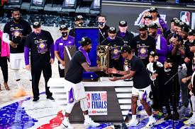
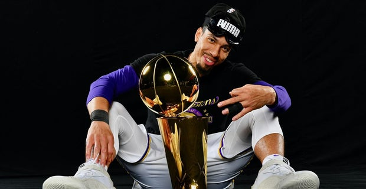

## Current Laker News

**What Current Laker News is About?**

Current Laker News is about keeping up with the NBA has to offer, featuring Laker rumors, trade talk, discussions, game stats and more!

**LOS ANGELES LAKERS WIN THE 2020 NBA CHAMPIONSHIP**

Lebron James and Anthony Davis lead the Lakers to their 17th Championship. Lebron James ending with a 28 point triple double to end off a complete blowout against the Miani Heat, 106 to 93. It wasn't a surprise that the Lakers had won with an exhausted Jimmy Butler and an injured Goran Dragic on the opposing side. The run that they made was very impressive after beating every "underdog" team they went against, the Blazers, Rockets and the Nuggets. Many role players stepping it up, such as KCP, Dwight Howard, Danny Green and others. 

**Danny Green Recieves Death Threats for a Dreadful Game 4-5 Performance**

After Danny Green missed a vital three pointer that would win them the championship, him and his wife recieved awful messages via social media and other platforms. His overall performance was not the best with what he was capable of, but it is completely unacceptable to send him hurtful messages over a basketball game. 

[Click Here 4 More](https://lakersnation.com/)
